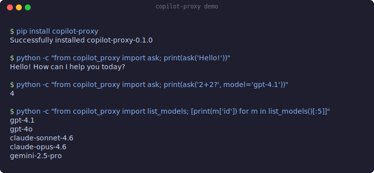

# Copilot Proxy

[](https://github.com/hsaghir/copilot-proxy/actions/workflows/ci.yml)
[](https://www.python.org/downloads/)
[](https://opensource.org/licenses/MIT)

Access GitHub Copilot's LLM models (GPT-4.1, GPT-5.x, Claude, Gemini, and more) from any Python script via a local HTTP server. Works with the standard OpenAI Python client. Zero dependencies.

<p align="center">
  
</p>

## Prerequisites

- **VS Code** with the **GitHub Copilot** extension (requires a Copilot subscription)
- **Node.js** (v18+) — for building the VS Code extension
- **Python 3.10+**

## Quick Start

### One-command install

```bash
git clone https://github.com/hsaghir/copilot-proxy.git
cd copilot-proxy
make install
```

This builds the VS Code extension, installs it, and installs the Python client. Then reload VS Code (`Ctrl+Shift+P` → "Reload Window").

<details>
<summary>Manual install (without Make)</summary>

**1. Install the VS Code extension:**

```bash
cd vscode-extension
npm install
npm run compile
npx @vscode/vsce package --allow-missing-repository
code --install-extension copilot-proxy.vsix
```

Reload VS Code. The proxy starts automatically on `http://127.0.0.1:19823`.

**2. Install the Python client:**

```bash
pip install -e .
# or with uv:
uv pip install -e .
```

</details>

### Verify it works

```python
from copilot_proxy import ask
print(ask("Hello!"))
```

## Usage

### Python Client (zero dependencies)

```python
from copilot_proxy import ask, chat, list_models

# Simple question (uses default model)
response = ask("Explain neural networks")

# Use a specific model
response = ask("Explain quantum computing", model="gpt-4.1")

# Multi-turn conversation
response = chat([
    {"role": "system", "content": "You are a helpful assistant."},
    {"role": "user", "content": "What is 2+2?"}
], model="claude-sonnet-4")

# List all available models
for m in list_models():
    print(f"  {m['id']} ({m['vendor']})")
```

### OpenAI Python Client (drop-in compatible)

```python
from openai import OpenAI

client = OpenAI(base_url="http://127.0.0.1:19823/v1", api_key="dummy")

response = client.chat.completions.create(
    model="gpt-4.1",
    messages=[{"role": "user", "content": "Hello!"}]
)
print(response.choices[0].message.content)

# Streaming
for chunk in client.chat.completions.create(
    model="gpt-4.1",
    messages=[{"role": "user", "content": "Tell me a joke"}],
    stream=True
):
    print(chunk.choices[0].delta.content or "", end="")
```

### HTTP API (curl)

```bash
# List models
curl http://127.0.0.1:19823/v1/models

# Chat completion
curl http://127.0.0.1:19823/v1/chat/completions \
  -H "Content-Type: application/json" \
  -d '{"model": "gpt-4.1", "messages": [{"role": "user", "content": "Hello!"}]}'
```

## Available Models

With a GitHub Copilot subscription you get access to many models. Run `list_models()` or `curl http://127.0.0.1:19823/v1/models` to see all. Common ones:

| Model | ID |
|-------|-----|
| GPT-4.1 | `gpt-4.1` |
| GPT-5.1 | `gpt-5.1` |
| GPT-5.4 | `gpt-5.4` |
| GPT-4o | `gpt-4o` |
| Claude Sonnet 4.6 | `claude-sonnet-4.6` |
| Claude Opus 4.6 | `claude-opus-4.6` |
| Claude Haiku 4.5 | `claude-haiku-4.5` |
| Gemini 2.5 Pro | `gemini-2.5-pro` |
| Gemini 3 Pro | `gemini-3-pro-preview` |

## Structured Output with Pydantic

```bash
pip install copilot-proxy[pydantic]
```

```python
from pydantic import BaseModel
from copilot_proxy import ask
import json

class MovieReview(BaseModel):
    title: str
    rating: float
    summary: str

schema = MovieReview.model_json_schema()
prompt = f"Review Inception. Return JSON matching this schema: {json.dumps(schema)}"

response = ask(prompt, model="gpt-4.1")
review = MovieReview.model_validate_json(response)
```

## Configuration

The proxy uses sensible defaults but everything is configurable:

| Setting | Default | How to change |
|---------|---------|---------------|
| Proxy port | `19823` | VS Code: `Settings → Copilot Proxy → Port` |
| Python base URL | `http://127.0.0.1:19823` | Env var `COPILOT_PROXY_URL` or `CopilotClient(base_url=...)` |

## Error Handling

```python
from copilot_proxy import ask, ProxyConnectionError, ModelNotFoundError

try:
    result = ask("Hello", model="gpt-4.1")
except ProxyConnectionError:
    print("Proxy not running — reload VS Code")
except ModelNotFoundError:
    print("Model not available")
```

## Troubleshooting

| Problem | Fix |
|---------|-----|
| `Connection refused` on port 19823 | Reload VS Code. Check Output → "Copilot Proxy" panel. |
| `EADDRINUSE: address already in use` | `lsof -ti:19823 \| xargs kill -9` then reload VS Code. |
| Empty responses | Make sure you're signed into GitHub Copilot in VS Code. |
| `No models available` | Open Copilot Chat in VS Code first to initialize the session. |
| Model returns empty but `gpt-4o` works | Try specifying a different model — not all models are available in all regions. |

## Development

```bash
pip install -e ".[dev]"      # install with test deps
pytest tests/test_client.py -v  # unit tests (no proxy needed)
pytest -v                       # all tests (proxy must be running)
```

See [CONTRIBUTING.md](CONTRIBUTING.md) for details.

## License

MIT
