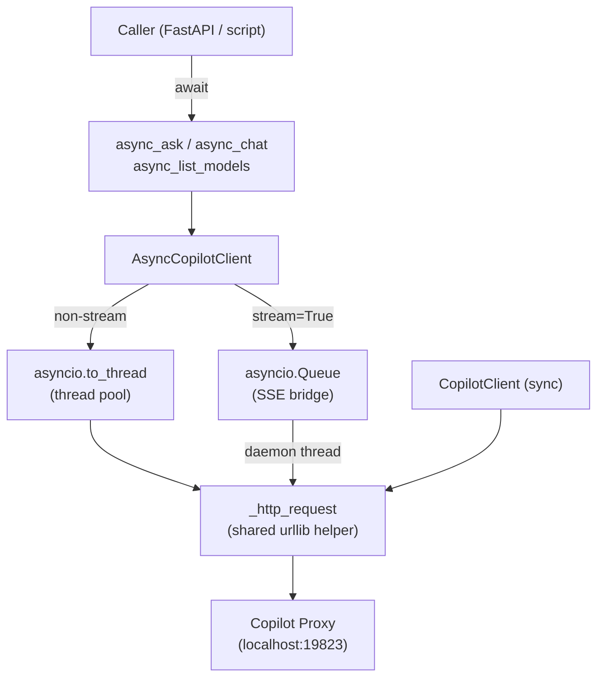

# Build Presentation: Native Async/Await Support for the Python Client

## 1. Overview

Added `AsyncCopilotClient` and four module-level `async_*` convenience functions to the `copilot_proxy` Python client, making it a first-class citizen in async frameworks (FastAPI, LangGraph, AutoGen). The implementation uses `asyncio.to_thread` + a thread/queue SSE bridge — zero new runtime dependencies, fully backward-compatible.

**Task completion: 7/7 tasks completed** (all phases: core implementation, testing, docs/examples).

---

## 2. Architecture



---

## 3. What Changed

### Core: `AsyncCopilotClient` class
**Files:** `src/copilot_proxy/client.py`

Added `AsyncCopilotClient` with identical constructor signature to `CopilotClient`, making it a drop-in async replacement. `_request` delegates to a shared `_http_request` helper via `asyncio.to_thread`. Streaming uses a daemon thread + `asyncio.Queue` bridge with a `threading.Event` for clean cancellation.

```python
async def _async_stream_response(self, payload: dict) -> AsyncIterator[str]:
    queue: asyncio.Queue[str | None] = asyncio.Queue()
    stop_event = threading.Event()
    # SSE reader runs in a daemon thread; pushes chunks into the queue.
    thread = threading.Thread(target=_read_sse, daemon=True)
    thread.start()
    try:
        while True:
            item = await queue.get()
            if item is None: break
            if isinstance(item, BaseException): raise item
            yield item
    finally:
        stop_event.set()  # signals early cancel on break
```

### Module-level async functions & public API
**Files:** `src/copilot_proxy/client.py`, `src/copilot_proxy/__init__.py`, `pyproject.toml`

Added `async_ask`, `async_chat`, `async_list_models`, `async_is_running` as module-level functions backed by a lazy singleton `_default_async_client`. All four exported in `__all__`. Version bumped to `0.3.0` in both `__init__.py` and `pyproject.toml`.

### Test infrastructure
**Files:** `tests/conftest.py`, `tests/test_client.py`

Extracted shared `mock_server` fixture (an in-process `HTTPServer` that fakes the proxy) into `tests/conftest.py`. Updated `tests/test_client.py` to consume it from there. Enables reuse across all async test files.

### Async test suite (130 tests total)
**Files:** `tests/test_async_client.py`, `tests/test_async_chat.py`, `tests/test_async_client_basic.py`, `tests/test_async_module_functions.py`

Four async test files covering: `list_models`, `is_running` (true/false), `ask`, `chat` (non-stream + stream), `ModelNotFoundError`, `ProxyConnectionError`, trailing slash normalization, unicode, long prompts, and all module-level async functions. `asyncio_mode = "auto"` set in `pyproject.toml` — no per-test `@pytest.mark.asyncio` needed.

### Documentation & examples
**Files:** `README.md`, `examples/async_usage.py`

Added `### Async Python Client` section to README with examples for single `await`, streaming, and `asyncio.gather` parallel calls. `examples/async_usage.py` is a runnable script demonstrating all four patterns with wall-clock timing for the parallel case.

---

## 4. Design Decisions

**`asyncio.to_thread` over raw `asyncio` HTTP**
- *Why:* Reuses the existing `urllib`-based `_http_request` helper verbatim — zero new dependencies and no reimplementation risk.
- *Tradeoff:* Each request consumes a thread-pool slot; at high concurrency (100+ parallel calls) this could saturate the default pool. Not a concern for the target use cases.

**Thread + `asyncio.Queue` for SSE streaming**
- *Why:* The blocking SSE reader cannot be made non-blocking without replacing `urllib` entirely. The queue bridge is idiomatic and correctly handles early consumer `break` via `stop_event`.
- *Tradeoff:* One extra thread per active stream. Daemon-thread design prevents process-exit blocking.

**Shared `_http_request` helper extracted to module level**
- *Why:* Avoids duplicating the `urllib`/error-handling logic in both sync and async client classes.
- *Tradeoff:* The `method` parameter is silently overridden to `"POST"` when `data` is provided (pre-existing behavior, not introduced here). Would be misleading if non-POST-with-body methods are ever needed.

---

## 5. Incomplete Work & Known Issues

**Blocked tasks:** None — all 7 tasks completed.

**Known issues from code review:**
- **MEDIUM (fixed):** `async_is_running` module function had no behavioral tests (only callable/`__all__` assertions). Two tests added.
- **MEDIUM (noted, not resolved):** ~600 lines of near-duplicate test code across `test_async_client_basic.py`, `test_async_chat.py`, and `test_async_module_functions.py` vs. `test_async_client.py`. All use `asyncio.run()` wrappers despite `asyncio_mode = "auto"` making that unnecessary. Recommend consolidating into `test_async_client.py` in a follow-up.
- **LOW (fixed):** Dead code branch in `AsyncCopilotClient.ask()` — unreachable streaming fallback replaced with `assert isinstance(result, str)`.
- **LOW (fixed):** Misleading docstrings in `test_async_client_basic.py` / `test_async_chat.py` claiming "works without pytest-asyncio" — corrected.
- **LOW (noted):** `_http_request` silently overrides caller's `method` arg when `data` is present. No bug today; could mislead future contributors.

---

## 6. Risks & Next Steps

- **Test duplication debt:** Three `asyncio.run()`-wrapper test files are redundant given `asyncio_mode = "auto"`. Consolidate before this grows further.
- **Thread pool saturation:** `asyncio.to_thread` uses the default executor (typically 32 threads). Bulk `asyncio.gather` with >32 concurrent requests will queue. Document the limit or allow custom executor injection.
- **Module-level singleton race:** `_default_async_client` has a benign TOCTOU creation race under extreme concurrency. Acceptable for a simple library; add a note in the docstring if it becomes a concern.
- **`async_chat` streaming return type:** `async_chat(..., stream=True)` returns an `AsyncIterator`, but the type hint says `str | AsyncIterator[str]`. Callers need `isinstance` check or must know to pass `stream=True`. Consider separate `async_stream_chat` function for cleaner typing.
- **No integration test for `asyncio.gather` parallel pattern** — the primary value proposition. Add at least one test firing 3 concurrent requests.

**Manually test before merging:**
1. `asyncio.run(async_ask("Hello"))` in a plain script with VS Code extension running
2. `async for chunk in await async_chat([...], stream=True)` — verify real-time output
3. `asyncio.gather(*[async_ask(p) for p in prompts])` — verify wall-clock speedup
4. `break` inside `async for` on a stream — verify no thread leak

---

## 7. Quick Start

```bash
pip install -e '.[dev]'
pytest tests/ -v          # 130 tests should pass
python examples/async_usage.py   # requires VS Code extension running
```

```python
import asyncio
from copilot_proxy import async_ask, async_chat
print(asyncio.run(async_ask("What is 2+2?")))
```
